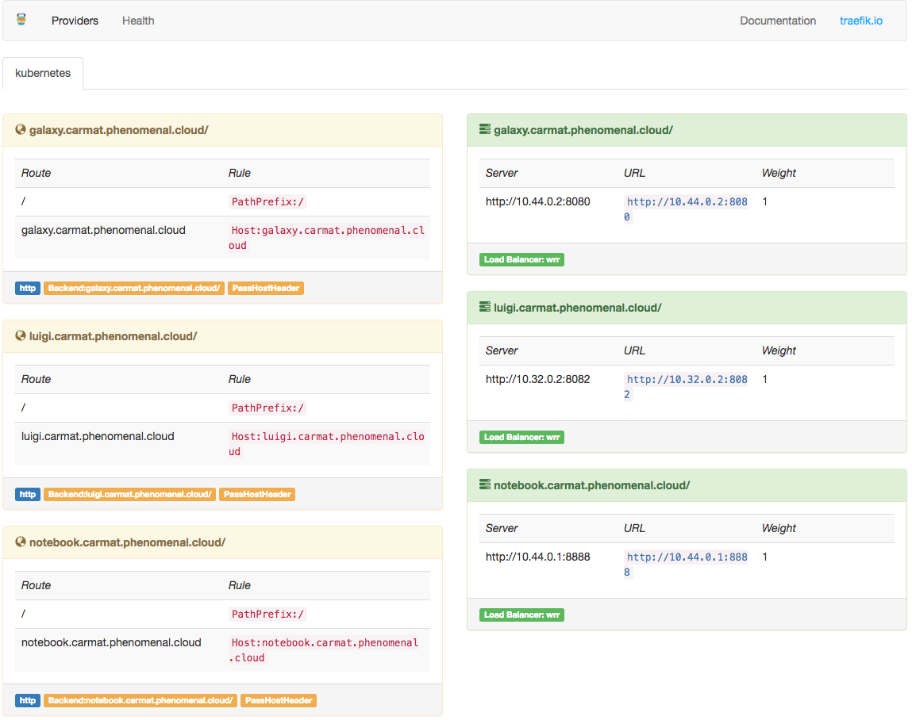

Deploy your first application
=============================

In this guide we are going to deploy a simple application: `cheese <https://github.com/kubenow/helm-charts/tree/master/charts/cheese>`_. We will deploy 3 web pages with a 2 replication factor. The master node will act as a reverse proxy, load balancing the requests among the replicas in the Kubernetes nodes.

The simple cluster that we just deployed uses `nip.io <http://nip.io>`_ as base domain for incoming HTTP traffic. First, we need to figure out our cluster domain by running::

  grep domain inventory

The command will return something like ``domain=37.153.138.137.nip.io``, meaning that our cluster domain name in this case would be ``37.153.138.137.nip.io``.

In KubeNow we encourage to deploy and define SaaS-layer applications using `Helm <https://github.com/kubernetes/helm>`_. The KubeNow community maintain a Helm repository that contains applications that are developed and tested for KubeNow: https://github.com/kubenow/helm-charts. To deploy the cheese application you can run the following command, substituting ``<your-domain>`` with the domain name that you got above::

  kn helm install --name cheese --set domain=<your-domain> kubenow/cheese

If everything goes well you should be able to access the web pages at:

- http://stilton.<your-domain>
- http://cheddar.<your-domain>
- http://wensleydale.<your-domain>

Traefik reverse proxy
---------------------

KubeNow uses the `Traefik <https://traefik.io/>`_ reverse proxy as ingress controller for your cluster. Traefik is installed on one or more nodes, namely edge nodes, which have a public IP associated. In this way, we can access services with a few floating IP without needing LBaaS, which may not be available on certain cloud providers.

In the default setting KubeNow doesn't deploy any edge node, and it runs Traefik in the master node. 

Accessing the Traefik UI
~~~~~~~~~~~~~~~~~~~~~~~~

One simple and quick way to access the Traefik UI is to tunnel via SSH to one of the edge nodes with the following command::

    ssh -N -f -L localhost:8080:localhost:8080 ubuntu@<your-domain>

Using SSH tunnelling, the Traefik UI should be reachable at http://localhost:8080, and it should look something like this:

In the left side you can find your deployed frontends URLs, whereas on the right side the backend services.
